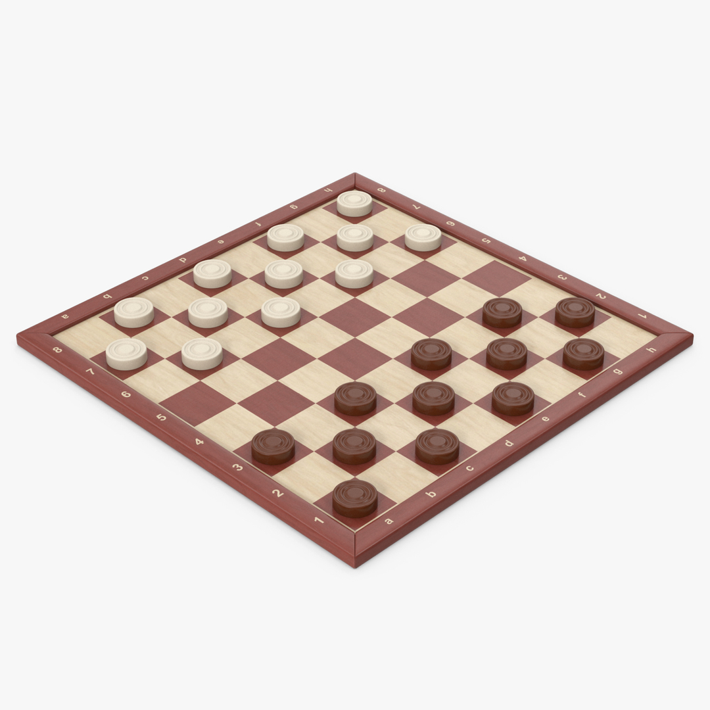

# 과제 개요

체커판이 포함된 이미지가 주어졌을 때, Python의 opencv 라이브러리를 이용해 아래 네 가지 문제를 해결하는 과제입니다.

* **Checkerboard**: 이미지에 포함된 체커판이 국제 룰(10 * 10) 규격인지, 아니면 영미식 룰(8 * 8) 규격인지 판별하는 문제
* **Perspective Transform (수동)**: 사용자로부터 마우스 클릭을 통해 네 모서리의 위치를 입력받은 뒤 정방형으로 보드를 출력하는 문제
* **Perspective Transform (자동)**: 이미지에서 체커판만 추출해서 정방형으로 출력하는 문제
* **Counting the pieces**: 체커판 위에 있는 어두운색 말과 밝은색색 말의 개수를 세는 문제

2번 문제는 강의 자료에 있는 코드를 활용해 쉽게 해결할 수 있습니다. 3번 문제를 해결해야 1/4번 문제를 편하게 해결할 수 있을 것으로 판단해서, 3번 문제를 먼저 해결한 다음 1번 문제와 4번 문제를 차례로 해결했습니다.

# HW 1-3. Perspective Transform (자동) 접근 방식

볼록 사각형 형태의 외곽선을 구한 뒤, 사각형의 꼭짓점을 이용해 투시 변환을 적용하는 방식으로 문제에 접근했습니다.

처음에는 이미지를 그레이 스케일로 변환한 다음 `cv2.Canny`, `cv2.HoughLinesP`와 `cv2.findContours`를 이용해 외곽선을 검출했습니다.

 

외곽에 있는 소수의 칸을 제외한 모든 칸이 검출된다는 것을 확인했고, 민틈을 메꾸기 위해 외곽선을 구성하는 모든 꼭짓점을 포함하는 가장 작은 볼록다각형(convex hull)을 구했습니다. Andrew's monotone chain algorithm을 사용하면 $n$개의 점이 있을 때 $O(n \log n)$ 시간에 볼록 껍질을 구할 수 있습니다.

하지만 위 그림과 같이 사각형이 검출되지 않는다는 경우가 있다는 것을 알게 되었습니다. 이를 해결하기 위해 서로 최대한 수직에 가까우면서 길이가 긴 4개의 변을 고르는 방식을 이용해 사각형을 검출했습 니다. 검출한 사각형은 아래 그림에서 파란색 선으로 나타내었습니다.

  

변환 행렬을 구하는 일련의 과정은 `checker_board.py` 파일의 57-87번 라인에 있는 `auto_perspective_matrix` 함수에서 확인할 수 있습니다. 문제 해결 과정에서 얻은 이미지는 `/report/solve/hw1-3-{m}.png` 에서 확인할 수 있습니다.

이 밖에도 모든 점을 포함하면서 둘레가 가장 작은 직사각형([BOJ 19586 울타리](https://www.acmicpc.net/problem/19586), [$O(n \log n)$ 솔루션 코드](http://boj.kr/d69cfcb0c4674b7c9abc2415b29c6d0d))를 찾는 등의 방법을 시도해 봤지만, 좋은 결과를 얻진 못했습니다.

# HW 1-1. Checkerboard 접근 방식

이미지에서 에지를 검출한 다음 그들의 교점을 이용해 격자 칸을 하나씩 추출하는 방식으로 문제에 접근했습니다.

먼저 HW 1-3에서 구현한 투시 변환을 적용한 다음, 그레이 스케일로 변환하고 블러 처리를 한 뒤, `cv2.Canny`, `cv2.HoughLineP`를 이용해 에지를 검출했습니다. 아래 그림과 같이 이미지의 에지를 잘 검출하지만, 실제 에지가 아닌 것도 검출한다는 문제점이 있습니다.

올바르지 않은 에지를 제거하기 위해 간선의 점수를 계산한 뒤, 에지의 점수가 일정 기준 (`line_threshold`) 미만이면 보지 않는 방식을 사용했습니다. 에지의 점수를 계산하는 방법은 다음과 같습니다. `hw1_1.py` 파일의 5-24번 라인에 있는 `get_diff_random_sample` 함수에서도 확인할 수 있습니다.

1. 에지(선분)가 연결하는 두 점 사이에서 랜덤한 점 $p$ 선택
2. 랜덤한 각도 $\theta$를 정한 다음, 단위 벡터 $\overrightarrow{v} = (\cos\theta, \sin\theta)$를 만들어서 $p+\overrightarrow{v}$와 $p-\overrightarrow{v}$의 밝기 차이 계산
3. 만약 올바른 에지였다면 두 점의 밝기 차이가 항상 클 것이라는 추측을 이용, 15번의 랜덤 샘플링을 통해 얻은 차이의 중앙값을 점수로 사용

`line_threshold`값을 결정하는 것도 어려움이 있었는데, 이미지마다 밝기의 차이가 다르므로 모든 이미지에서 같은 값을 사용하는 것이 불가능했습니다. 주어진 이미지에 적응적으로 기준을 정하기 위해 이분 탐색을 수행했습니다. 점수가 가장 높은 올바르지 않은 에지를 구하는 것을 목표로 이분 탐색을 수행했으며, 구체적으로 아래와 같은 방법으로 결정 문제를 해결했습니다. 이분 탐색을 수행하는 것은 `hw1_1.py` 파일의 137-144번 라인, 결정 문제를 해결하는 것은 34-43번 라인에 있는 `check_lines_orthogonal_threshold` 함수에서 확인할 수 있습니다.

1. 적당한 기준 $m$에 대해, 점수가 $m$ 이상인 에지만 남김
2. 두 에지의 각도가 $0^o$와 $90^o$ 모두에 가깝지 않으면 올바르지 않은 에지가 있는 것으로 취급

비슷한 에지가 여러 번 등장하는 것도 문제입니다. 이를 해결하기 위해 기울기가 비슷하고 서로 가까이에 있는 에지를 하나로 합치는 것을 구현했습니다. 또한, 위 과정에서 아직 제거되지 않은 올바르지 않은 간선을 제거하기 위해, 끼인 각의 각도가 90도에 가장 가까운 두 에지를 찾아서 축으로 지정한 다음, 두 축과 연결되지 않은 모든 에지를 제거했습니다. 에지를 합치는 것과 제거하는 과정은 너비 우선 탐색을 이용해 구현했으며, 각각 `hw1_1.py` 파일의 47-71번 라인에 있는 `bfs_group` 함수와 90-112번 라인에 있는 `bfs_line` 함수에서 확인할 수 있습니다. 축을 찾는 과정은 75-86번 라인의 `get_most_orthogonal_axis` 함수에 구현되어 있습니다.

여기까지 처리한 결과는 다음과 같습니다. 더 밝은색으로 표시된 직선이 축으로 지정된 에지입니다.

   

노란색은 에지들의 교점으로, 격자 칸의 꼭짓점이 모두 추출되는 것을 기대했지만 모든 에지가 검출되지 않아서 꼭짓점 또한 모두 찾지 못했습니다. 하지만 최소한 한 칸의 격자 칸은 온전히 검출되었기 때문에, 격자 칸 한 칸의 폭을 구한 다음, 축을 격자 칸의 폭 만큼씩 밀면서 격자 칸의 개수를 구했습니다

# HW 1-4. Counting the pieces 접근 방식

이미지에서 원을 모두 검출한 다음, 원 내부의 밝기와 이미지 전체의 평균 밝기의 차이를 이용해 말의 색을 구분하는 방식으로 문제에 접근했습니다.

먼저 HW 1-3에서 구현한 투시 변환을 적용한 다음, 그레이 스케일로 변환하고 블러 처리를 한 뒤, `cv2.HoughCircles`를 이용해 원을 검출했습니다. 이때 `minDist`, `minRadius`, `maxRadius`를 적절히 조절해서 실제 말만 검출되도록 작성했습니다.

이후, 말의 색을 결정하기 위한 기준인 이미지의 평균 밝기를 구한 뒤, 검출된 원을 모두 보면서 각각의 원의 중심 근방의 평균 밝기를 계산했습니다. 만약 원 중심 근방의 밝기가 이미지 전체의 평균 밝기보다 어두우면 어두운 말, 그렇지 않으면 밝은색 말로 판정했습니다.

# 계산 기하 라이브러리

문제 해결과 코드 작성의 편의를 위해 계산 기하 알고리즘과 opencv 이미지 조작을 위한 함수를 작성해서 사용했습니다.

### my_geometry.py

2차원 좌표 평면 상의 점을 표현하기 위한 클래스 `Point2D`, 직선&선분을 표현하기 위한 클래스 `Line2D`를 포함하고 있습니다. `Point2D` 클래스는 점의 좌표 $(x, y)$를 관리하는 클래스, `Line2D` 클래스는 직선을 $ax+by+c=0$ 꼴로 표현하기 위한 3개의 실수 $a, b, c$와 선분 $\overline{p_1p_2}$의 양쪽 끝점 $p_1, p_2$를 관리하는 클래스입니다. 코드 작성을 모두 끝낸 지금 드는 생각으로는, 선분 $\overline{p_1p_2}$를 표현할 때 $(p_1, p_2)$를 저장하는 대신 $p_1+t\times\overrightarrow{d}$로 표현(단, $\overrightarrow{d} = p_2-p_1$, $0\le t \le 1$)하는 것이 더 좋았을 것 같습니다.

이 밖에도 두 직선 사이에 끼인 각을 구하는 함수 `get_angle`, 두 선분의 교차 여부를 판별하는 `segment_intersect`, 두 선분 사이의 최단 거리를 구하는 `segment_distance`, $O(n \log n)$ 시간에 볼록 껍질을 구하는 `convex_hull` 함수가 구현되어 있습니다. 모두 직접 작성한 코드로, 과거 C++로 작성했던 코드는 주석에 있는 링크에서 확인할 수 있습니다.

### check_board.py

길이가 무한한 직선을 그리는 함수 `draw_line`, 적당한 크기로 점을 그리는 `draw_point`, 점이 이미지 안에 있는지 확인하는 `on_board`와 같은 함수를 작성해 코드 작성의 편의를 더했습니다. 또한, 모든 점을 포함하는 볼록 사각형을 구하는 함수 `make_to_quadrilaterals`, 투시 변환 행렬을 수동/자동으로 구하는 함수 `manual_perspective_matrix`, `auto_perspective_matrix`와 실제 투시 변환을 수행하는 함수인 `perspective_transform`도 함께 구현했습니다.

# 실험 결과

### 테스트 이미지

아래 8개의 이미지를 이용해 실험했습니다. m번째 테스트 이미지는 `/images/img{m}.(png|jpg)`에서 확인할 수 있습니다. n번 문제의 m번째 실험 결과의 이미지는 `/report/test_image/hw1-{n}-img-{m}.PNG`에서 확인할 수 있습니다.

   

   

### HW 1-1. CheckerBoard

모든 이미지에서 올바른 정답을 구했습니다.

### HW 1-2. Perspective Transform (수동)

4개의 꼭짓점을 좌상단부터 시계 방향으로 클릭한 결과입니다.

 

### HW 1-3. Perspective Transform (자동)

테두리가 나오는 등의 오차가 조금 있지만, 전체적으로 올바른 결과가 나왔습니다.

 

 

 

 

### HW 1-4. Countint the pieces

말의 높이가 큰 5번 이미지를 제외한 모든 테스트 이미지에서 올바른 결과를 구했습니다.

 

 

 

 

 

